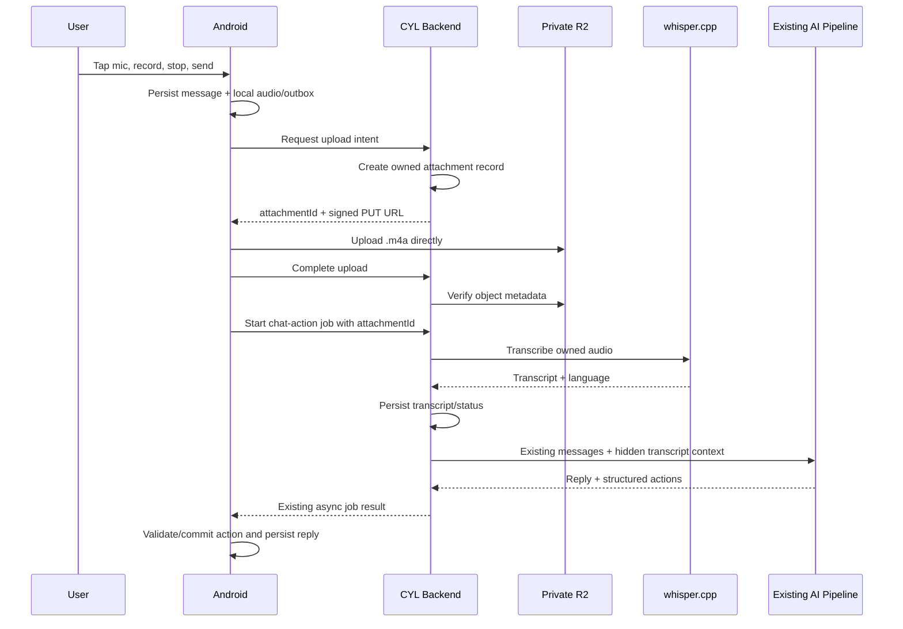

# CYL AI Voice Note Implementation Plan

> Product decision (2026-08-03): the primary microphone action in AI chat is
> voice dictation, not a persistent voice attachment. Android captures speech
> through `SpeechRecognizer`, returns editable text to the composer, and sends
> only that text after user confirmation. It does not create an audio attachment,
> upload to R2, or require backend voice-note storage. The persistent attachment
> architecture below is retained as deferred design material for a future,
> separately exposed voice-note feature.

Status: Primary dictation path implemented and compile verified; persistent voice-note path deferred

Audit date: 2026-08-03

Implementation evidence:

| Phase | State | Evidence |
|---|---|---|
| Dictation path | Implemented, compile verified | Android `SpeechRecognizer` engine, typed state/error handling, partial transcript UI, editable final composer text, permission handling and timeout recovery added on 2026-08-03 |
| Phase 0 contract foundation | Implemented, compile verified | Shared generic wire contract, typed state/error, storage/transcription boundaries and non-inventing fakes added; Android/backend/shared contract compiled on 2026-08-02 |
| Phase 0 runtime fixture gate | Not run | Tests were intentionally not executed under the current compile-only instruction |
| Phase 1 backend asset foundation | Implemented, compile verified | V16 persistence, in-memory/PostgreSQL repositories, private R2 presigner, lifecycle service, orphan cleanup scheduler, authenticated ownership routes, idempotency and upload verification added; shared/backend/Android compile passed on 2026-08-03 |
| Phase 1 runtime gate | Not run | Ownership, R2 PUT/HEAD/GET/delete, and idempotent replay still require configured integration/runtime verification; tests were intentionally not executed under the current compile-only instruction |
| Phase 2 Android local recording and playback | Implemented, compile verified | Room 19 normalized attachment storage, app-private AAC/M4A recorder, typed recorder state, permission flow, single Media3 player, voice composer, local send snapshot and replay were added; Android compile passed on 2026-08-03 |
| Phase 2 physical-device gate | Not run | Microphone capture, OEM permission behavior, short-stop handling and playback still require manual physical-device verification; tests/install were intentionally not executed under the current compile-only instruction |
| Phase 3 durable upload and outbox | Implemented, compile verified | Room 20 persists SHA-256, upload state/progress and remote asset ID; authenticated upload intent, cancellable signed PUT, completion, unique WorkManager retry, message-first queueing and app-start recovery were added; Android and backend compile passed on 2026-08-03 |
| Phase 3 runtime gate | Not run | Offline recovery, force-stop replay and configured R2 upload/HEAD verification still require a physical-device plus deployed-backend run; tests/install were intentionally not executed under the current compile-only instruction |

This document is the source of truth for adding user voice notes to the existing CYL AI chat. It intentionally separates verified facts, architecture decisions, implementation phases, and completion evidence so the feature is not built from assumptions.

## 1. Product Scope

### In scope for the first release

- User can record a voice note inside the existing CYL AI composer.
- User can cancel, preview, delete, send, and replay the recording.
- A voice note can be sent without a text prompt.
- The visible chat message shows audio, not an injected automatic prompt.
- Audio is uploaded privately and transcribed asynchronously.
- The transcript is supplied to the same AI chat/action pipeline already used by Home AI and Page AI.
- A Malay or English voice instruction can trigger the same validated page/database actions as typed text.
- Audio, transcript, status, and playback remain available after app restart and on another signed-in device.
- Upload, transcription, and AI processing can be retried idempotently.

### Explicitly out of scope for the first release

- AI voice replies or text-to-speech.
- Live speech-to-text while the user is speaking.
- Always-listening or background microphone recording.
- Voice calls or full-duplex conversation.
- Speaker diarization.
- On-device transcription models.
- Replacing the existing text, image, or file attachment flow.

These exclusions prevent the first implementation from mixing recording, streaming, transcription, and TTS into one unstable feature.

## 2. Verified Current State

The following facts were checked against the current repository. They are not assumptions.

| Area | Current state | Evidence |
|---|---|---|
| Chat attachment domain | `ChatMessageAttachment` remains backward-compatible and now carries optional audio/local lifecycle metadata | `androidApp/.../domain/model/ChatMessage.kt`, `ChatAttachment.kt` |
| Local persistence | Display snapshots remain in `attachmentsJson`; normalized lifecycle state is stored in `chat_attachments` | `ChatMessageEntity.kt`, `ChatAttachmentEntity.kt`, `ChatHistoryRepositoryImpl.kt` |
| Room version | Current version is 20 with explicit attachment migrations through `MIGRATION_19_20` | `CylDatabase.kt`, `DatabaseModule.kt`, `20.json` |
| Attachment input | Images and text files are read into memory; images are encoded as `data:` URLs | `AiChatAttachmentReader.kt` |
| Chat composer | `AiChatSheet` owns text/image staging while `VoiceNoteController` owns voice lifecycle and the shared player | `AiChatSheet.kt`, `VoiceNoteController.kt` |
| AI entry point | Home and Page AI share `HomeViewModel.sendChatMessageScoped()` | `HomeViewModel.kt` |
| AI Android contract | Request field is currently named `images` and carries image/text payloads | `AiRepository.kt`, `AiDtos.kt` |
| AI backend contract | `ChatWithActionsRequest.images` is image/text oriented | `backend/.../model/ai/AiModels.kt` |
| AI processing | Backend prepares text files and vision context before planning actions | `backend/.../service/AiService.kt` |
| Async jobs | Persistent AI jobs and idempotency already exist | `AiRoutes.kt`, `AiJobService.kt`, `AiJobRepository.kt` |
| Chat sync | Raw `attachmentsJson` is synchronized to PostgreSQL | `SessionSyncCoordinator.kt`, `ChatSyncRoutes.kt` |
| Backend migration | Latest voice asset migration is V16 | `backend/src/main/resources/db/migration/V16__chat_attachments.sql` |
| Recording permission | `RECORD_AUDIO` is declared and requested only after the mic action | `AndroidManifest.xml`, `AiChatSheet.kt` |
| Playback dependency | Media3 ExoPlayer 1.10.1 is installed behind one `ChatAudioPlayer` owner | `libs.versions.toml`, `Media3ChatAudioPlayer.kt` |
| Object storage | Private R2 storage and signed URL boundaries exist; Android now uses a durable WorkManager outbox and direct signed PUT client | `R2VoiceAssetStorage.kt`, `ChatAttachmentService.kt`, `HttpChatAttachmentUploadGateway.kt` |

### Consequence

Audio must not reuse the existing image `dataUrl` implementation. Base64 audio inside `attachmentsJson` would duplicate large binary data across Room, sync payloads, PostgreSQL, AI requests, and chat history. Voice notes need asset references and object storage.

## 3. Architecture Decisions

### ADR-VN-001: Extend the existing AI chat

There will be one AI chat pipeline. Voice is another attachment type, not a second Home/Page AI implementation.

### ADR-VN-002: Native recording, library playback

- Recording: Android framework `MediaRecorder`.
- Playback: AndroidX Media3 ExoPlayer.
- Persistent retries: existing WorkManager infrastructure.
- Simple recording amplitude: `MediaRecorder.maxAmplitude`; no PCM engine for MVP.
- Recorder construction is wrapped for API compatibility because CYL supports API 26 through 36; Compose must not call version-specific recorder constructors directly.

`AudioRecord` is intentionally deferred. It is only needed later for low-level PCM processing or real-time transcription.

### ADR-VN-003: Private object storage

- Canonical audio bytes live in a private Cloudflare R2 bucket.
- Android uploads directly using a short-lived presigned PUT URL.
- Backend generates the URL; R2 credentials never enter the Android app.
- Playback uses a short-lived presigned GET URL.
- Database and chat sync store IDs and compact metadata only.
- Presigned R2 URLs use the R2 S3 API domain, not the custom public domain.

### ADR-VN-004: Separate speech-to-text gateway

The existing Qwen/LM Studio chat model is not treated as an audio transcription engine.

Backend introduces a provider-neutral `VoiceTranscriptionGateway`. The first implementation calls a private whisper.cpp service exposed through an authenticated Cloudflare Tunnel. A future provider can replace it without changing routes, repositories, or AI chat orchestration.

### ADR-VN-005: Batch transcription before AI planning

The first release follows:

`record -> upload -> transcribe -> AI plan -> validate -> execute -> reply`

The AI receives transcript text, never an R2 credential or raw storage key. Transcription is hidden context. It is not inserted as an automatic visible prompt.

### ADR-VN-006: Same action safety as typed chat

- The transcript enters the existing retrieval, structured action, validation, transaction, idempotency, and destructive-action policy.
- Voice does not bypass clarification or confirmation rules.
- Empty/no-speech transcription cannot mutate a page.
- Audio from one user cannot be attached to another user's request.

### ADR-VN-007: Backward-compatible attachment migration

Image and text attachments continue to work. New audio fields are optional with defaults. Older messages remain readable, and older clients can ignore unknown metadata.

## 4. Target Flow



## 5. Functional Requirements

| ID | Requirement |
|---|---|
| VN-001 | Record audio from the existing AI composer on a physical Android device. |
| VN-002 | Cancelled or unsent recordings are removed from local storage. |
| VN-003 | Sent audio is persisted locally before network work begins. |
| VN-004 | Audio upload uses a private asset ID and direct signed upload, never base64 JSON. |
| VN-005 | A failed upload is retryable and does not duplicate the object or chat message. |
| VN-006 | Backend transcribes the audio once per immutable checksum/provider version. |
| VN-007 | Transcript feeds the same AI/action pipeline as typed text. |
| VN-008 | Blank visible text is valid when a voice attachment exists. |
| VN-009 | Voice message is playable from local file or signed remote URL. |
| VN-010 | Only one chat audio item plays at a time. |
| VN-011 | Upload/transcription/AI status survives app restart. |
| VN-012 | Audio and metadata synchronize to another device without syncing binary JSON. |
| VN-013 | Deleting a message/session eventually deletes the private object and transcript. |
| VN-014 | Every attachment endpoint validates authentication and ownership. |
| VN-015 | Existing image/text attachments remain compatible. |
| VN-016 | Search can index the transcript, but never local paths or signed URLs. |
| VN-017 | AI history rebuild includes hidden transcript context for later conversation turns. |
| VN-018 | Destructive voice commands use the existing destructive-action policy. |

## 6. Recording Contract

Initial limits are deliberately conservative:

- Container: MPEG-4 (`.m4a`).
- Codec: AAC-LC.
- Channels: mono.
- Maximum duration: 5 minutes.
- Maximum uploaded size: 10 MB.
- Minimum useful duration: 500 ms.
- Recording is foreground-only.
- The app copies/creates the final file inside app-owned storage, not an external content URI.

The recorder must expose a state machine instead of boolean UI flags:

```text
Idle
  -> RequestingPermission
  -> Recording(elapsedMs, amplitude)
  -> Recorded(localPath, durationMs, sizeBytes)
  -> Cancelled
  -> Failed(errorCode)
```

Calling `stop()` can fail on very short or invalid recordings. That exception must become `recording_too_short` or `recording_failed`; it must not crash Compose.

## 7. Attachment State Machine

The durable attachment lifecycle is:

```text
LocalReady
  -> UploadQueued
  -> Uploading
  -> Uploaded
  -> Transcribing
  -> Ready
  -> AiQueued
  -> AiProcessing
  -> Completed

Any network stage -> RetryableFailure
Any validation/auth stage -> PermanentFailure
Any non-terminal stage -> Deleted
```

State transitions must be validated in one reducer/use case. UI must not assign arbitrary states.

## 8. Data Model

### 8.1 Android domain model

Replace image-specific naming over time with a generic model:

```kotlin
enum class ChatAttachmentKind { Image, TextFile, Audio }

data class ChatAttachment(
    val id: String,
    val messageId: String?,
    val sessionId: String,
    val kind: ChatAttachmentKind,
    val name: String,
    val mimeType: String,
    val sizeBytes: Long,
    val durationMs: Long? = null,
    val localPath: String? = null,
    val remoteAssetId: String? = null,
    val waveform: List<Int> = emptyList(),
    val transcript: String? = null,
    val language: String? = null,
    val status: ChatAttachmentStatus,
    val progressPercent: Int = 0,
    val aiJobId: String? = null,
    val errorCode: String? = null,
)
```

Do not persist signed URLs. They expire and are credentials. Resolve them only when playback starts.

### 8.2 Room migration 18 -> 19

Add a normalized `chat_attachments` table. Keep `chat_messages.attachmentsJson` temporarily as a backward-compatible display/sync snapshot.

Required columns:

| Column | Purpose |
|---|---|
| `id` | Stable client attachment ID |
| `messageId` nullable | Linked after the user sends |
| `sessionId` | Chat ownership/scope locally |
| `kind` | `image`, `text_file`, or `audio` |
| `name`, `mimeType`, `sizeBytes` | Display and validation metadata |
| `durationMs` | Audio duration |
| `localPath` nullable | App-private local file |
| `remoteAssetId` nullable | Backend attachment ID |
| `waveformJson` | Compact normalized amplitude samples |
| `transcript` nullable | Synced transcript for context/search |
| `language` nullable | Detected language |
| `status`, `progressPercent` | Durable pipeline state |
| `aiJobId` nullable | Resume backend job polling |
| `errorCode` nullable | Typed retry/UI error |
| `createdAt`, `updatedAt` | Ordering and cleanup |

Indexes:

- `messageId`
- `sessionId`
- `status`
- unique `remoteAssetId` where supported by Room/SQLite strategy

Migration requirements:

- Existing messages require no data rewrite.
- Schema export `19.json` must be generated.
- DatabaseModule must register `MIGRATION_18_19`.
- No destructive migration fallback.

### 8.3 Backend migration V16

Add `V16__chat_attachments.sql` with a normalized private asset table.

Required fields:

```text
id
user_id
session_client_id
message_client_id nullable
kind
storage_key
mime_type
original_name
size_bytes
duration_ms
sha256
status
transcript nullable
transcript_language nullable
transcription_provider nullable
transcription_model nullable
transcription_version nullable
error_code nullable
idempotency_key
created_at
updated_at
deleted_at nullable
```

Constraints:

- Unique `(user_id, idempotency_key)`.
- Unique private `storage_key`.
- Valid status check constraint.
- Non-negative size/duration.
- Ownership always derived from authenticated user, never request body.
- No signed URL or API credential stored.

An uploaded attachment can exist before chat sync creates its message row, so `message_client_id` must not require an immediate foreign key to `chat_messages` in V16.

## 9. API Contract

All routes are authenticated under `/api/v1`.

### 9.1 Create upload intent

`POST /chat-attachments/upload-intents`

Headers:

```text
Idempotency-Key: <stable attachment id>
```

Request:

```json
{
  "kind": "audio",
  "mimeType": "audio/mp4",
  "originalName": "voice-note.m4a",
  "sizeBytes": 245871,
  "durationMs": 18400,
  "sha256": "hex-digest",
  "sessionClientId": "...",
  "messageClientId": "..."
}
```

Response `201` or replayed `200`:

```json
{
  "attachmentId": "...",
  "status": "pending_upload",
  "uploadUrl": "short-lived signed R2 URL",
  "requiredHeaders": {
    "Content-Type": "audio/mp4"
  },
  "expiresAtEpochMillis": 0
}
```

### 9.2 Complete and verify upload

`POST /chat-attachments/{attachmentId}/complete`

- Verify authenticated ownership.
- HEAD the object.
- Verify expected size, content type, and checksum metadata.
- Move state idempotently from `pending_upload` to `uploaded`.
- Reject a changed immutable payload for the same idempotency key.

### 9.3 Read attachment status

`GET /chat-attachments/{attachmentId}`

Returns compact metadata, processing state, transcript when ready, and a short-lived playback URL only when requested/authorized.

### 9.4 Delete attachment

`DELETE /chat-attachments/{attachmentId}`

- Soft-delete database record immediately.
- Enqueue object deletion.
- Repeated delete returns success.
- Deleted attachments cannot enter AI requests.

### 9.5 Extend existing AI job request

Add a backward-compatible field:

```json
{
  "attachmentIds": ["owned-audio-attachment-id"]
}
```

Keep current `images` support until image/file migration is intentionally done later.

The AI job idempotency fingerprint uses attachment ID plus immutable SHA-256, not a signed URL or raw audio.

## 10. Backend Boundaries

New abstractions:

```kotlin
interface ChatAttachmentRepository
interface VoiceAssetStorage
interface VoiceTranscriptionGateway
```

Suggested implementation files:

```text
backend/domain/ChatAttachmentRepository.kt
backend/domain/VoiceAssetStorage.kt
backend/domain/VoiceTranscriptionGateway.kt
backend/data/PostgresChatAttachmentRepository.kt
backend/storage/R2VoiceAssetStorage.kt
backend/transcription/WhisperCppTranscriptionGateway.kt
backend/service/ChatAttachmentService.kt
backend/service/VoiceTranscriptionService.kt
backend/routes/ChatAttachmentRoutes.kt
```

Responsibilities:

| Component | Responsibility |
|---|---|
| Route | Parse auth/request, return typed HTTP response |
| Attachment service | Validate lifecycle, ownership, idempotency, limits |
| Repository | PostgreSQL state and row locking |
| Storage adapter | Sign PUT/GET, HEAD, delete private object |
| Transcription gateway | Provider transport only |
| Transcription service | Download/normalize, retry, persist transcript |
| AI service | Consume prepared transcript context only |

`AiService` must not gain R2, multipart, audio conversion, or whisper HTTP logic.

## 11. Transcription Contract

### Initial provider

- Private whisper.cpp service.
- Backend calls its `/inference` endpoint through an authenticated endpoint/tunnel.
- Audio is normalized to mono 16 kHz PCM/WAV before inference if the provider cannot accept `.m4a` directly.
- Provider timeouts are longer than normal text generation and run only inside the persistent async job.

### Gateway result

```kotlin
data class VoiceTranscriptResult(
    val text: String,
    val language: String?,
    val provider: String,
    val model: String,
    val version: String,
)
```

Do not invent a confidence threshold unless the selected provider exposes a documented, reliable score. For MVP, reject empty/no-speech output and preserve provider diagnostics.

### AI context format

The transcript is added as hidden user attachment context, for example:

```text
[Voice note transcript, language=ms]
saya guna empat ringgit beli makan hari ini
[/Voice note transcript]
```

It must not be shown as an extra user bubble and must not be stored in `ChatMessage.content` merely to make the AI see it.

For later conversation turns, the history builder reconstructs hidden context from the attachment transcript.

## 12. Android Boundaries

Suggested components:

```text
domain/model/ChatAttachment.kt
domain/repository/ChatAttachmentRepository.kt
domain/usecase/chat/StageVoiceNoteUseCase.kt
domain/usecase/chat/SendVoiceNoteUseCase.kt
domain/usecase/chat/RetryVoiceNoteUseCase.kt
data/local/entity/ChatAttachmentEntity.kt
data/local/dao/ChatAttachmentDao.kt
data/media/AndroidVoiceRecorder.kt
data/media/Media3ChatAudioPlayer.kt
data/repository/ChatAttachmentRepositoryImpl.kt
data/worker/VoiceAttachmentUploadWorker.kt
presentation/ai/VoiceNoteController.kt
presentation/ai/AiVoiceComposer.kt
presentation/ai/AiVoiceMessage.kt
```

Rules:

- `AiChatSheet` renders state and dispatches events; it does not own recorder APIs or file IO.
- `HomeViewModel` continues to use one scoped send path.
- Rename image-specific attachment APIs only through a backward-compatible migration.
- WorkManager performs upload retry; UI coroutine lifetime must not own durable upload work.
- Media3 player has one owner/controller so scrolling/recomposition does not create a player per message.
- Recorder and player resources are always released.

## 13. Composer UX

### Idle

- Show microphone icon when the composer has no sendable text/attachment.
- Show send icon when text or any attachment is staged.
- Microphone has a tooltip/content description.

### Permission

- Request `RECORD_AUDIO` only after the user taps the microphone.
- First denial shows a concise retry explanation.
- Permanent denial offers an app-settings action.
- Do not request microphone permission at app startup.

### Recording

MVP uses tap-to-start and tap-to-stop. This is more accessible and less gesture-conflicting than hold/slide behavior.

Show:

- elapsed time,
- simple live amplitude,
- cancel icon,
- stop icon,
- remaining limit near the maximum.

### Recorded draft

Show a flat audio row with:

- play/pause,
- duration,
- compact waveform,
- delete,
- send.

No nested card inside the composer.

### Sent message

Show:

- play/pause,
- elapsed/total duration,
- waveform/progress,
- subtle status for uploading/transcribing/failure,
- retry action only when actionable,
- optional `Show transcript` after transcription.

AI replies remain plain, matching the current chat direction.

## 14. Offline and Restart Behavior

1. Save the user message and attachment locally before upload.
2. Queue upload with a stable attachment/message idempotency key.
3. On network loss, retain local playback and show retryable status.
4. WorkManager resumes upload when connected.
5. After upload completion, start or resume the backend AI job once.
6. Persist `aiJobId` so app restart can poll the same job.
7. Backend job idempotency prevents duplicate transcription/reply.
8. Existing chat sync transmits compact attachment metadata and transcript only.

The app must never create a second user message merely because upload or polling was retried.

## 15. Typed Errors

| Error code | User-facing meaning | Retry |
|---|---|---|
| `microphone_permission_denied` | Microphone access is unavailable | User action |
| `recording_too_short` | Recording contains too little audio | Record again |
| `recording_failed` | Device recorder failed | Record again |
| `audio_limit_exceeded` | Duration or size is over the limit | Record shorter |
| `upload_offline` | Waiting for network | Automatic |
| `upload_url_expired` | Signed URL expired | Automatic new intent |
| `upload_validation_failed` | Uploaded bytes do not match metadata | Re-upload |
| `attachment_forbidden` | Attachment is not owned by this user | No |
| `transcription_unavailable` | STT service is temporarily unavailable | Automatic/backoff |
| `transcription_failed` | Audio could not be transcribed | Manual retry |
| `no_speech_detected` | No usable speech found | Record again |
| `ai_processing_failed` | Transcript exists but AI job failed | Retry AI only |
| `playback_failed` | Audio could not be loaded/decoded | Refresh URL/retry |

Raw exceptions, provider responses, storage keys, and signed URLs must not be displayed in chat.

## 16. Security and Privacy

- Private bucket only; no public object URL.
- R2 keys exist only in Render/backend environment variables.
- Presigned PUT/GET TTL target: 5 minutes.
- Sign/restrict the expected content type.
- Server verifies owner, size, duration, status, and checksum before use.
- Limit to 5 minutes and 10 MB per audio attachment initially.
- Add per-user upload and transcription rate limits.
- Never log audio body, transcript body, signed URL, or storage key.
- Structured logs may contain attachment ID, byte count, duration, phase, latency, and typed error code.
- Delete staged local files on cancel.
- Delete orphan server uploads older than 24 hours.
- Message/session deletion triggers remote object and transcript cleanup.
- A signed URL is treated as a bearer credential and never persisted.
- Retrieval checks the same authenticated user/workspace boundary before the transcript reaches AI.

## 17. Configuration

Backend/Render environment variables:

```text
VOICE_NOTE_ENABLED=false
VOICE_MAX_BYTES=10485760
VOICE_MAX_DURATION_SECONDS=300
R2_ACCOUNT_ID=
R2_BUCKET=
R2_ACCESS_KEY_ID=
R2_SECRET_ACCESS_KEY=
R2_ENDPOINT=https://<ACCOUNT_ID>.r2.cloudflarestorage.com
R2_SIGNED_URL_TTL_SECONDS=300
VOICE_TRANSCRIBE_BASE_URL=
VOICE_TRANSCRIBE_API_TOKEN=
VOICE_TRANSCRIBE_MODEL=
VOICE_TRANSCRIBE_TIMEOUT_SECONDS=180
```

Secrets must not be placed in Android `local.properties`, BuildConfig, Git, logs, or `/ai/status`.

## 18. Implementation Phases

### Phase 0: Contract freeze

Deliverables:

- Approve this scope and limits.
- Add generic attachment DTO with optional audio metadata.
- Add typed state/error enums.
- Define upload/transcription interfaces and fake implementations.

Gate:

- No binary audio field exists in JSON DTOs.
- Existing image/text attachment fixtures still decode.
- Android and backend compile.

### Phase 1: Backend asset foundation

Deliverables:

- Flyway V16 attachment table.
- PostgreSQL repository.
- R2 storage adapter and presigner.
- Upload-intent, complete, status, playback URL, and delete routes.
- Ownership, idempotency, limits, checksum, and orphan cleanup.

Gate:

- Repeating upload intent/complete does not create duplicate records.
- User B cannot read/delete/use User A attachment.
- Backend compile succeeds.

### Phase 2: Android local recording and playback

Deliverables:

- `RECORD_AUDIO` permission flow.
- MediaRecorder adapter and state reducer.
- Room 18 -> 19 migration and normalized attachment DAO.
- Media3 single-player controller.
- Record, cancel, preview, and replay UI on a physical device.

Gate:

- Cancel deletes local file.
- Short/failed stop does not crash.
- Recomposition does not leak recorder/player.
- Android compile succeeds.

### Phase 3: Durable upload and outbox

Deliverables:

- Direct signed upload client.
- WorkManager upload/retry.
- Message saved before upload.
- Durable status, progress, `remoteAssetId`, and idempotency.
- App restart recovery.

Gate:

- Offline send remains visible and uploads after reconnection.
- Force-stopping during upload does not duplicate message/object.
- Android and backend compile.

### Phase 4: Transcription pipeline

Deliverables:

- whisper.cpp gateway behind interface.
- Audio normalization where required.
- Benchmark candidate Whisper models with a fixed Malay/English voice fixture set on the actual host hardware before selecting `VOICE_TRANSCRIBE_MODEL`.
- `audio_transcribing` backend job phase.
- Persist transcript/provider/model/version/language.
- Typed retry and no-speech handling.

Gate:

- Same attachment is not transcribed twice on idempotent retry.
- Provider outage leaves audio safe and retryable.
- Transcript never appears in logs.
- Selected model, fixture set, transcription quality notes, and processing latency are recorded instead of inferred.
- Backend compile succeeds.

### Phase 5: Existing AI/action integration

Deliverables:

- `attachmentIds` in the existing async AI job request.
- Ownership/hydration before AI planning.
- Hidden transcript context builder.
- History context reconstruction from transcript.
- Existing action validation, transaction, and destructive policy retained.

Gate:

- Voice: `tambah makan empat ringgit hari ini` produces the same action as typed text.
- A voice note without visible text gets a normal AI response.
- Empty/no-speech transcript performs no mutation.
- Retry produces one assistant reply and one action plan.

### Phase 6: Sync, multi-device, deletion, and search

Deliverables:

- Compact attachment metadata in chat sync.
- Remote signed playback on a second device.
- Transcript indexing without signed URLs/local paths.
- Message/session delete cleanup.
- Local cache eviction and orphan cleanup.

Gate:

- Another device can load history and play the voice note.
- Deleting the message makes the asset inaccessible.
- Existing image/file history remains intact.

### Phase 7: Hardening and rollout

Deliverables:

- Feature flag and backend capability response.
- Rate limits, timeout/backoff, operational metrics.
- Accessibility/content descriptions.
- Malay/English noisy-audio regression fixtures.
- Deployment and rollback notes.

Gate:

- Feature can be disabled without app update.
- Provider/storage failure does not break text chat.
- No raw secret or audio content appears in diagnostics.

## 19. Regression Matrix

Implementation must add coverage for these behaviors even if execution of tests is deferred by the current user workflow.

### Android unit coverage

- Recorder state transition and invalid transition.
- Very short recording failure.
- Attachment reducer and typed errors.
- Existing attachment JSON backward compatibility.
- Voice transcript hidden-context mapping.
- One-player ownership.
- Duplicate send/idempotency guard.

### Android instrumentation/manual device coverage

- Runtime microphone permission allow/deny/permanent deny.
- Record/stop/cancel on a physical phone.
- Rotate/recompose/open keyboard during staged recording.
- Offline send, app restart, network restore.
- Local and remote playback.

The Android emulator is not accepted as proof of microphone recording because the official Android MediaRecorder documentation states that emulator audio recording is not supported reliably.

### Backend coverage

- Upload route authentication and ownership.
- MIME/size/duration/checksum validation.
- Idempotent upload intent and completion.
- Expired/replayed URL recovery.
- Transcription success, timeout, empty speech, retry.
- AI job resumes with existing transcript.
- Cross-user attachment injection rejection.
- Object cleanup after message/session deletion.

### End-to-end acceptance prompts

1. Malay action: `Tambah makan empat ringgit untuk hari ini.`
2. Malay page target: `Dalam Budget Tracker, tambah minyak lima ringgit.`
3. English planning: `Plan my spending for the rest of this month.`
4. Destructive: `Padam semua transaksi bulan April.`
5. No speech/background noise only.
6. Voice note plus typed correction: `Bukan RM40, RM4.`

## 20. Definition of Done

Voice note is complete only when all statements below are true:

- [ ] Recording works on a real Android phone without crashes.
- [ ] Audio is never stored or synchronized as base64 JSON.
- [ ] User message is durable before network work.
- [ ] Upload and AI processing resume after app restart.
- [ ] Object storage is private and owner-checked.
- [ ] Transcript reaches the same AI pipeline as typed text.
- [ ] No visible automatic prompt is added for audio-only send.
- [ ] AI actions remain validated, transactional, idempotent, and undo-aware.
- [ ] Playback works locally and from another device.
- [ ] Delete cleans local data, transcript, and remote object.
- [ ] Existing image, file, text chat, Home AI, and Page AI do not regress.
- [ ] Android and backend compile successfully.
- [ ] Implementation evidence is recorded phase by phase.

## 21. Anti-Hallucination Execution Protocol

Every implementation turn must follow this protocol:

1. State the exact phase and requirement IDs being implemented.
2. Re-read the current target files before editing; do not rely on an earlier summary alone.
3. Confirm the latest Room/Flyway migration number before creating a migration.
4. Map every edit to a requirement or gate in this document.
5. Do not add an endpoint, field, provider capability, or library behavior without verifying its contract.
6. Keep provider-specific code behind `VoiceAssetStorage` or `VoiceTranscriptionGateway`.
7. Preserve defaults/backward compatibility for existing attachment JSON.
8. Compile the affected module after the phase; do not claim runtime behavior from compilation alone.
9. Record what was verified, what was only compiled, and what still requires a physical device or deployed service.
10. Do not mark a phase complete while any gate in that phase remains unproven.
11. Stop and update this plan if repository architecture changes invalidate a decision.
12. Never silently replace failed transcription with invented transcript text.

## 22. Decisions That Must Be Measured

These values are intentionally not declared complete from documentation alone:

| Decision | Required evidence |
|---|---|
| Whisper model | Fixed Malay/English recordings, transcript review, latency and memory on the real transcription host |
| Recorder sample rate/bitrate fallback | Physical devices spanning supported Android versions |
| Maximum concurrent transcriptions | Load observation on the self-hosted machine without starving LM Studio |
| Retry/backoff values | Render-to-tunnel failure logs and provider latency |
| Remote retention period | Product/privacy decision; initial behavior ties retention to message/session deletion |
| Search indexing of transcript | Privacy review plus chat-history search performance measurement |

An implementation turn may choose a provisional value behind configuration, but it must not label that value optimal without this evidence.

## 23. Official References

- Android MediaRecorder and microphone permission: https://developer.android.com/media/platform/mediarecorder
- AndroidX Media3 ExoPlayer: https://developer.android.com/media/media3/exoplayer/hello-world
- Cloudflare R2 presigned URLs: https://developers.cloudflare.com/r2/api/s3/presigned-urls/
- Cloudflare R2 direct uploads: https://developers.cloudflare.com/r2/objects/upload-objects/
- whisper.cpp repository: https://github.com/ggml-org/whisper.cpp
- whisper.cpp server implementation (`/inference`): https://github.com/ggml-org/whisper.cpp/blob/master/examples/server/server.cpp

## 24. Recommended Starting Point

Start with Phase 0 and Phase 1. Do not begin by placing a microphone icon in `AiChatSheet`. The first code change should establish the generic attachment contract and private asset lifecycle; otherwise the UI will force audio into the existing base64 image path and create a migration problem later.
